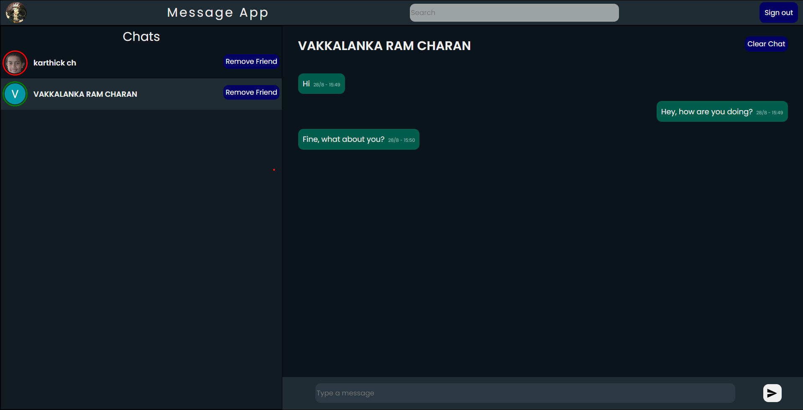

# Chat-App

## Table of Contents

1. [Brief Description](#brief-description)
2. [Deployment](#deployment)
3. [Environment Variables](#environment-variables)
4. [Languages Used](#languages-used)
5. [Dependencies and Libraries Used](#dependencies-and-libraries-used)
6. [Documentation](#documentation)
7. [Features](#features)
8. [Screenshots](#screenshots)
9. [Demo](#demo)
10. [Details](#details)
11. [Feedback](#feedback)

## Brief Description

- This project is a web chat application using React.js and Node.js that enables users to engage in real-time one-on-one and group conversations.
- The application leverages a range of technologies, including JWT-based user authentication, HTTP requests, WebSocket communication for instant messaging, and integration with Google Cloud services for data storeage and possibly user authentication.
- It offers features such as clearing chat history and adding/removing friends, all accessible through an intuitive user interface.
- It also includes features like message notifications and automatic scrolling to enhance the user experience.

## Deployment

To run this project, proceed with the following steps:

1. Fork this repository
2. Clone this repository in your local code editor (preferably VS Code)
3. Install dependencies and libraries required for client ->

   `cd client`

   `npm install`

4. Install dependencies and libraries required for server ->

   `cd server`

   `npm install`

5. Start the server ->

   `cd server`

   `nodemon index.js`

6. Start the client ->

   `cd client`

   `npm start`

7. Finally, this project will be launched in http://localhost:3000.

## Environment Variables

To run this project, you will need to get your own `Client ID` from [Google Cloud Console](https://console.cloud.google.com).

Create an account in Google Cloud Console

Google Could Console

Go to APIs and Services

APIs and Services

Then, in the Credentials section -> Create Credentials -> OAuth client ID

Credentials Section

Create OAuth Client ID

Create your own `Client ID` and insert it in the project directory _/chat-app/client/src/components/login/Login.js_ as shown:

Insert your Client ID

## Languages Used

- React.js - for developing the front-end part of the project

- Node.js - for developing the back-end part of the project

- SQL - for managing databases in the project

## Dependencies and Libraries Used

- [js-cookie](https://www.npmjs.com/package/js-cookie) - to simplify management of Cookies

  `npm i js-cookie`

- [jwt-decode](https://www.npmjs.com/package/jwt-decode) - for authentication and authorization of user

  `npm i jwt-decode`

- [react-icons](https://www.npmjs.com/package/react-icons) - for including popular styled icons

  `npm i react-icons`

- [react-router-dom](https://www.npmjs.com/package/react-router-dom) - for using React Router in web applications

  `npm i react-router-dom`

- [express](https://www.npmjs.com/package/express) - fast, unopinionated, minimalist web framework for Node.js

  `npm i express`

- [cors](https://www.npmjs.com/package/cors) - for providing a Express middleware that can be used to enable CORS (Cross-Origin Resource Sharing) with various options

  `npm i cors`

- [socket.io](https://www.npmjs.com/package/socket.io) - for handling incoming connections from clients, managing WebSocket communication, and emitting events to connected clients

  `npm i socket.io`

- [socket.io-client](https://www.npmjs.com/package/socket.io-client) - to establish connections to a Socket.IO server, emit events to the server, and listen for events sent from the server

  `npm i socket.io-client`

- [sqlite3](https://www.npmjs.com/package/sqlite3) - for managing Relational Databases (Relational Database Management System(RDBMS))

  `npm i sqlite3`

## Documentation

Refer to the below given respective documentations for the languages used to build this project.

- [Documentation for React.js](https://legacy.reactjs.org/docs/getting-started.html)

- [Documentation for Node.js](https://nodejs.org/en/docs)

- [Documentation for SQL](https://dev.mysql.com/doc/)

## Features

- User registration and authentication
- Sending and receiving text messages between users
- Real-time message updates

## Screenshots

Here are few screenshots of this project.

Login Page

Initially you have no friends

Adding Friends

Chat in Sender Point of View

Chat in Receiver Point of View

## Demo

Insert gif or link to demo

## Details

Name: Vakkalanka Ram Charan

University/College: Indian Institute of Technology Bhubaneshwar

Department: Electronics and Communication Engineering

## Feedback

If you have any feedback, please reach me out at ramcharanvakkalanka@gmail.com
